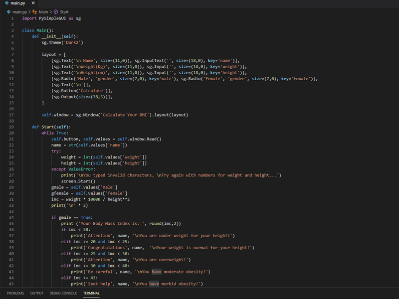
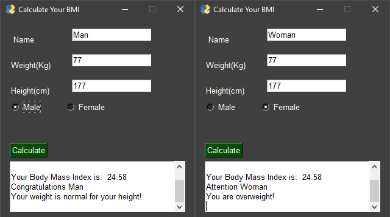
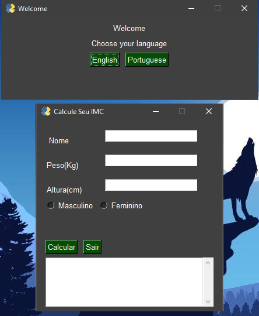

### Body Mass Index Analyzer
 This is an app to calculate your Body Mass Index.
 You will put your name, weight and height when asked,
 then we will show your BMI and analyze if it's ok.

### Some Screenshots
Made with Visual Studio Code IDE 

 Different results between men and women based on the body mass index table 

